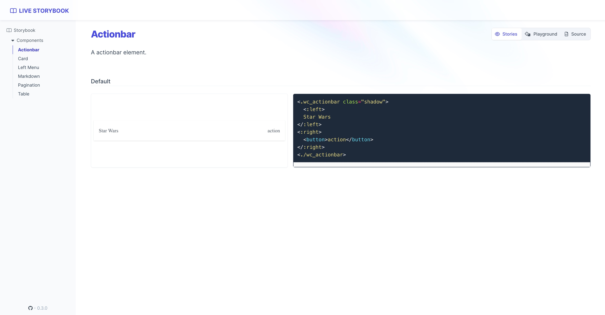
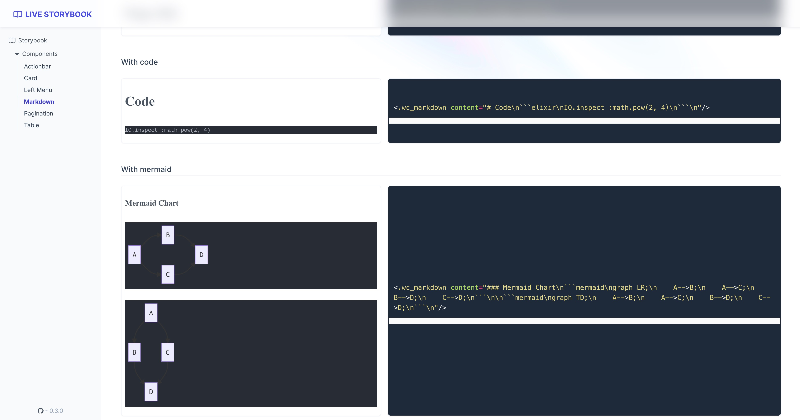

# Phoenix.WebComponent

[](https://github.com/gsmlg-dev/phoenix_webcomponent/actions/workflows/test-and-release.yml)

Collection of helpers to generate and manipulate Web Component.

Although this project was originally extracted from Phoenix,
it does not depend on Phoenix and can be used with any Plug
application (or even without Plug).

See the [docs](https://hexdocs.pm/phoenix_webcomponent/) for more information.

About at [Web Component](https://developer.mozilla.org/en-US/docs/Web/Web_Components)

## Install

Add deps in `mix.exs`
```elixir
    {:phoenix_webcomponent, "~> 2.0"},
```

Include in phoenix view helpers

```elixir
 defp view_helpers do
    quote do
        # import all helper functions
        use Phoenix.WebComponent

        # or 
        use Phoenix.WebComponent, :alias
        ...
    end
end
```

Include javascript

```javascript
import 'phoenix_webcomponent';
```

Use custom hook
```javascript
import "phoenix_webcomponent";
const PhxWCHook = window.__PhxWCHook__;
const liveSocket = new LiveSocket("/live", Socket, {hooks: { PhxWCHook }});
```

Send custom events to live view:
```html
<Element phx-wc-send-sync-content="load_content" phx-hook="PhxWCHook" />
<Element phx-wc-send-sync-content="load_content;loadAccepted" phx-hook="PhxWCHook" />
```
- In the first element, when element trigger customEvents `sync-content`, also use `pushEvent` send `load_content` to live view.
- Second element are same as first, but will call `loadAccepted` on element when receive server send feedback.

Receive live view event:
```html
<Element phx-wc-receive-update_content="updateContent" phx-hook="PhxWCHook" />
<!-- equal  -->
<Element phx-wc-receive="update_content;updateContent" phx-hook="PhxWCHook" />
```
- In this case, when live view fire `update_content` event, also trigger `updateContent` method on elmenet.
- If value(`updateContent`) is empty, trigger a same event `update_content` on element.

Import CSS

```javascript
import "phoenix_webcomponent/priv/static/phoenix_webcomponent.css"
```

### All helpers

- wc_actionbar
- wc_appbar
- wc_card
- wc_left_menu
- wc_markdown
- wc_pagination
- wc_table

## Live Storybook

[Live Storybook](https://phoenix-webcomponent.gsmlg.org)




