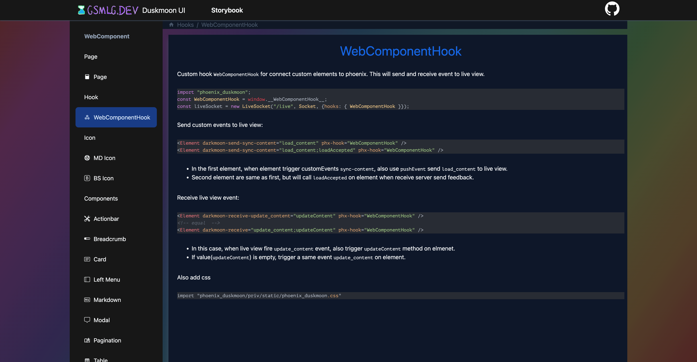
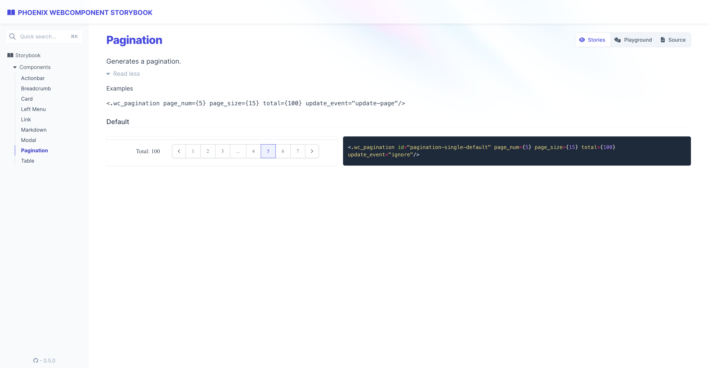
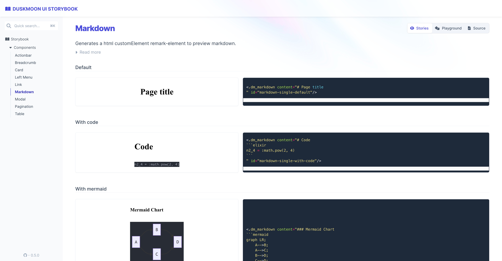

# PhoenixDuskmoon

[](https://github.com/gsmlg-dev/phoenix-duskmoon-ui/actions/workflows/test-and-release.yml)

Collection of helpers to generate and manipulate Web Component.

Although this project was originally extracted from Phoenix,
it does not depend on Phoenix and can be used with any Plug
application (or even without Plug).

See the [docs](https://hexdocs.pm/phoenix_duskmoon/) for more information.

About at [Web Component](https://developer.mozilla.org/en-US/docs/Web/Web_Components)

## Install

Add deps in `mix.exs`
```elixir
    {:phoenix_duskmoon, "~> 5.0"},
```

Include in phoenix view helpers

```elixir
defp html_helpers do
  quote do
    # import all helper functions
    use PhoenixDuskmoon.Component
    ...
  end
end
```

Import `css`

```css
@config "../tailwind.config.js";

@import "tailwindcss";
@plugin "@tailwindcss/typography";
@plugin "daisyui";
@import "phoenix_duskmoon/theme";
@import "phoenix_duskmoon/components";
```

## Live Storybook

[Live Storybook](https://duskmoon-storybook.gsmlg.dev)





